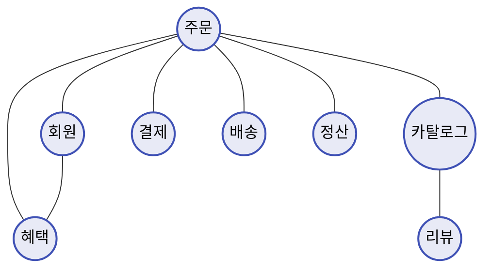
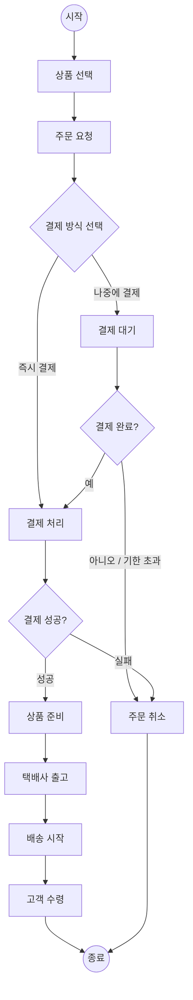
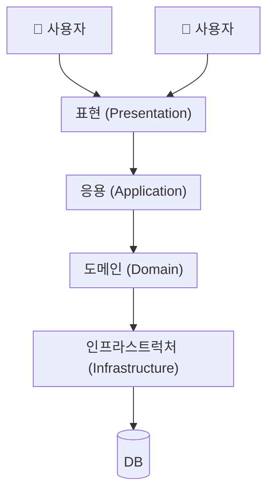

## 1. 도메인이란?

- 소프트웨어로 해결하고자 하는 문제 영역은 도메인에 해당한다.
  한 도메인은 다시 하위 도메인으로 나눌 수 있다.



- 도메인마다 고정된 하위 도메인이 존재하는 것은 아니다.
  예를들어 온라인 쇼핑몰 도메인이라도 소규모 업체는 `주문`, `배송` 정도만 하위 도메인으로 가질 수 있고, 대형 업체는 추가적으로 `추천`, `정산` ... 등 더 많은 하위 도메인을 포함 할 수 있다.

## 2. 도메인 전문가와 개발자 간 지식 공유

온라인 홍보, 정산, 배송 등 각 영여에는 전문가들이 존재한다.
각 도메인의 전문가들은 본인의 지식과 경험을 바탕으로 원하는 기능 개발을 요구한다.

개발자는 이런 요구사항을 분석하고 설계하여 코드를 작성하고 테스트하고 배포한다.

이 단계에서 요구사항은 첫 단추와 같다.
잘 못된 요구사항은 잘못된 코드를 야기하고 이를 나중에 바로 잡는건 어렵다.

> AI로 개발하는 요츰 요구사항을 정확히 이해하고 정리할 수 있는게 더욱 중요한 것 같다.

### 어떻게 요구사항을 올바르게 이해할 수 있을까?

직접 도메인 전문가와 대화를 하는 것 이다.
이 과정에서 개발자 또한 도메인 지식을 갖추는 것이 구체적인 요구사항을 정의하는데 중요하다.

> 대화를 통해서 질문하고 목적을 이해하고 방향성을 통일 시키는 것이 중요한 것 같다.

## 3. 도메인 모델

도메인 모델에는 다양한 정의가 존재하지만, 기본적으로 특정 도메인을 개념적으로 표현한 것이다.

도메인 모델을 사용하면 여러 관계자들이 동일한 모습으로 도메인을 이해하고 도메인 지식을 공유하는데 도움이 된다.

> 이 말은 1.2에서 말하는 직접 도메인 전문가와 대화를 하거나 팀간 회의 시 사용하면 좋을 것 같다.
> 또는 혼자 이해를 정리하고 재차 확인하느 과정에도 유용할 것 같다.

기본적으로 도메인 자체를 이해하기 위한 개념 모델이기 때문에 여러 형태로 표현할 수 있다.

1. 객체 도메인 모델

   ```mermaid
   classDiagram
   class OrderState {
       <<enumeration>>
   }

   class DeliveryStatus {
       <<enumeration>>
   }

   class Order {
       +String orderNumber
       +Money totalAmounts
       +changeShipping(shipping ShippingInfo)
       +cancel()
   }

   class Orderer {
       +String name
   }

   class OrderLine {
       +Money price
       +int quantity
       +amounts() Money
   }

   class ShippingInfo {
       +Address address
       +String message
   }

   class PaymentInfo

   class Address {
       +String zipCode
       +String address1
       +String address2
   }

   class Receiver {
       +String name
       +String phone
   }

   class Product {
       +String name
       +Money price
       +String detail
   }

   Order "1" --> "1" OrderState
   Order "1" --> "1" Orderer
   Order "1" --> "1" DeliveryStatus
   Order "1" --> "1..*" OrderLine
   Order "1" --> "1" ShippingInfo
   Order "1" --> "1" PaymentInfo
   ShippingInfo "1" --> "1" Address
   ShippingInfo "1" --> "1" Receiver
   OrderLine "1" --> "0..1" Product
   ```

2. 상태 도메인 모델

   ```mermaid
    stateDiagram-v2
   [*] --> 주문전

   주문전 --> 결제대기중 : 주문함 [결제안함]
   주문전 --> 상품준비중 : 주문함 [결제함]

   결제대기중 --> 상품준비중 : 결제함
   결제대기중 --> 주문취소됨 : 주문 취소함

   상품준비중 --> 주문취소됨 : 주문 취소함 / 결제 취소
   상품준비중 --> 출고완료됨 : 택배사에서 상품 수령함

   출고완료됨 --> 배송중 : 배송 시작함

   배송중 --> 배송완료됨 : 고객 수령함

   배송완료됨 --> [*]
   ```

3. 액티비티 다이어그램



위 방법 외에도 도메인 이해를 위한 방법이라면 여러 형태로 존재할 수 있다.

> 여러 도메인 모델을 기반으로 깊게 이해하는 것이 중요하고 각 하위 도메인 마다 모델을 나눌 수 있는 경험을 쌓는 것이 중요할 것 같다.

## 도메인 모델 패턴

일반적인 애플리케이션의 아키텍처는 아래와 같이 네 개의 영역으로 구성된다.



각 영역별 역할

| 영역           | 설명                                                                                                                                    |
| -------------- | --------------------------------------------------------------------------------------------------------------------------------------- |
| presentation   | 사용자의 요청을 처리하고 사용자에게 정보를 보여준다. 여기서 사용자는 소프트웨어를 사용하는 **사람뿐만 아니라 외부 시스템**일 수도 있다. |
| application    | 사용자가 요청한 기능을 실행한다. 업무 로직을 직접 구현하지 않으며 도메인 계층을 조합해서 기능을 실행한다.                               |
| domain         | 시스템이 제공할 도메인 규칙을 구현한다.                                                                                                 |
| Infrastructure | 데이터베이스나 메시징 시스템과 같은 외부 시스템과의 연동을 처리한다.                                                                    |

이전까지는 도메인 자체를 이해하는 데 필요한 개념이었다.
위에서 영역별로 정리한 내용은 마틴 파울러가 쓴 `엔터프라이즈 애플리케이션 아키텍처 패턴`책의 도메인 모델 패턴을 의미한다.

이중 도메인 계층은 도메인의 핵심 규칙을 구현한다.
주문 도메인의 경우 "출고전에 배송지를 변경 할 수 있다." 와 같은 코드가 도메인 계층에 위치한다.

> 이를 통해 SRP 원칙을 준수하고 변경점을 하나로 통일하여 일관성을 유지할 수 있을 것 같다. 또한 오류가 발생하더라도 응집도가 높아 주문 도메인만 확인하여 유지보수도 좋을 것 같다.

**이러한 도메인 규칙을 객체 지향 기법으로 구현하는 패턴이 도메인 모델 패턴이다.**

### 개념 모델과 구현 모델

개념 모델은 데이터베이스, 트랜잭션 처리, 성능, 구현 기술과 같은 것을 고려하지 않고 있지 않기 때문에 실제 코드를 작성할 때 개념 모델을 그대로 사용할 수 없다.

이러한 부분에 개발자가 도메인 전문과와 충분히 소통하여 최대한 개념 모델과 구현 모델을 일치시켜 목표 달성을 빠르게 할 수 있을 것이고 추후 도메인을 더 이해하게되어 보완하더라도 보수 비용이 저려할 것 같다.

하지만 처음부터 완벽한 개념 모델을 만들기보다는 전반적인 개요를 알 수 있는 수준으로 개념 모델을 작성하고 이를 바탕으로 이해하고 구현 모델로 점진적으로 발전시켜 나가야 한다.

## 도메인 모델 도출

도메인을 모델링할 때 기본이 되는 작업은 모델을 구성하는

- 핵심 구성요소
- 규칙
- 기능

을 찾는 것이다.

이 과정은 요구사항에서 출발한다.

> 위 3 가지를 도출할 수 없다면 요구사항이 불분명하거나 이해를 못했다는 것이다.
>
> 만약 요구사항을 통해 위 3가지를 분류할 수 있다면 객체지향적이고 도메인 이해도를 높여주> 는 코드를 작성할 수 있을 것 같다.
> 핵심 구성요소 : VO 또는 class
> 규칙 : 클래스의 valid method
> 기능 : 비즈니스 맥락을 기반 네이밍을 가진 method 및 usecase
>
> 도메인을 잘 분류하고 메서드 네이밍을 잘 만들어 둔다면 도메인 지식, 비즈니시 지식인 없> 는 새로운 개발자가 참여 했을 때 쉽게 적응하는데 도움될 것 같다.
>
> 만약 코드로 표현할 수 없는 부분이 있다면 주석 또는 문서화를 통해 정리하는게 좋을 것 같> 다.

## 6.엔티티와 밸류

도출한 모델은 크게 `entity`와 `value`로 구분할 수 있다.

### 엔티티

엔티티의 가장 큰 특징은 식별자를 가진다는 것이다.
이 식별자는 바꾸지 않고 고유하기 때문에 두 엔티티 객체의 식별자가 같으면 서로 같다고 판단할 수 있다.

> Java의 객체 세상에서는 동일한 객체임을 판단하기 위해 `equals()` , `hashCode()` 를 재정의하는데 엔티티 또한 객체기에 재정의가 필요한 경우 고려해야 한다.

엔티티의 식별자 생성 시점은 도메인의 특징과 사용하는 기술에 따라 달라질 수 있다.

- 특정 규칙에 따라 생성
- UUID
- 직접 지정

등의 방식으로 식별자를 생성할 수 있다.

### 밸류 타입

엔티티와 달리 식별자가 없고, 값 자체로 의미를 갖는 객체이다.
따라서 두 밸류 객체의 모든 속성 값이 같으면 같은 것으로 판단한다.

예를 들어 Address의 zipCode, address1, address2가 모두 같으면 같은 주소로 본다. "어떤 주소인지"가 중요하지 "몇 번째로 만든 주소 객체인지"는 의미가 없기 때문이다.

그렇다고 꼭 밸류 타입은 2개 이상의 필드를 가지고 있어야 하는 것은 아니다. 하나의 primitve type을 가지고 있더라도 의미와 조건을 내포한다면 충분히 VO로써의 가치가 있다.

또한 불변 객체로 생성하거나 Setter를 막아 의도와 다르게 사용되는 변수를 차단하는 것을 신경 써야한다.

> 밸류 타입을 활용해서 도메인을 더 잘 표현하고 책임을 분리하는 것이 중요하다.

### 도메인 모델에 set메서드 넣지 않기

JAVA 언어를 처음 배우면 get/set 메서드를 습관적으로 추가하고 자주 활용한다.
하지만 해당 메서드들은 가독성을 저하시키고 어떠한 의도로 변경하는지 불명확하고 도메인의 규칙을 파괴하는 원인이 될 수 있다.

도메인 객체가 불안전한 상태로 사용되는 것을 막기 위해선 set 사용을 삼가고 의미 있는 메서드를 만들어 보호하자

## 7. 도메인 용어와 유비쿼터스 언어

코드를 작성할 때 도메인에서 사용하는 용어는 매우 중요하다.
용어가 통일되어 있지 않다면 서로 용어를 번역하고 이해하는 추가 비용 발생한다.

> 실제로 통일된 용어가 있다면 온보딩도 쉽고 서로 같은 생각으로 회의를 진행할 수 있다.
> 요구사항을 잘 못 이해하는 경우도 줄어들 것이다.

에릭 에반스는 도메인 주도 설계에서 언어의 중요성을 강조하기 위해 **유비쿼터스 언어**라는 용어를 사용했다. 이는 전문가,개발자 등 이해관계자 간 공통의 언어를 만들고 이를 대화, 문서, 도메인 모델, 코드 등 모든 곳에서 같은 용어를 사용하는 것이다.

> 점점 더 유비쿼터스 언어가 중요해 지는 것 같다. 통일된 언어로 사용하면 AI도 추론하지 않> 고 명확하게 이해하고 작업할 수 있기에 적은 토큰으로 생산량을 높일 수 있을 것 같다.
> 제로 베이스로 만드는 경우 유비쿼터스 언어를 정의하고 문서화 하자 (유지보수인 경우도 물론 해야함)
