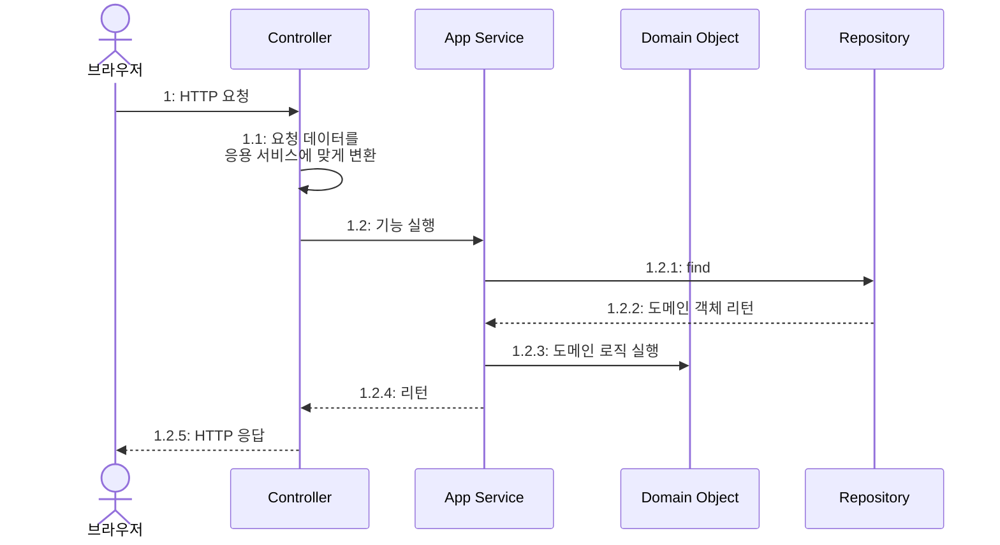
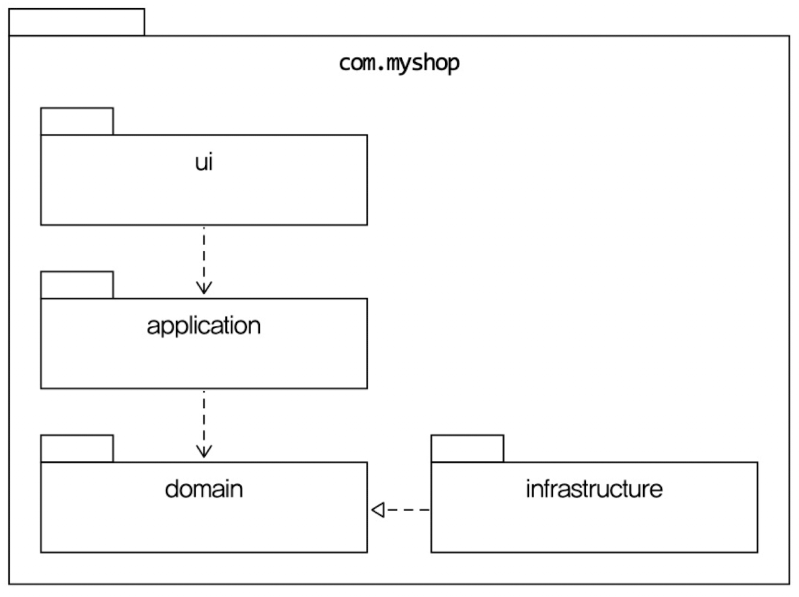
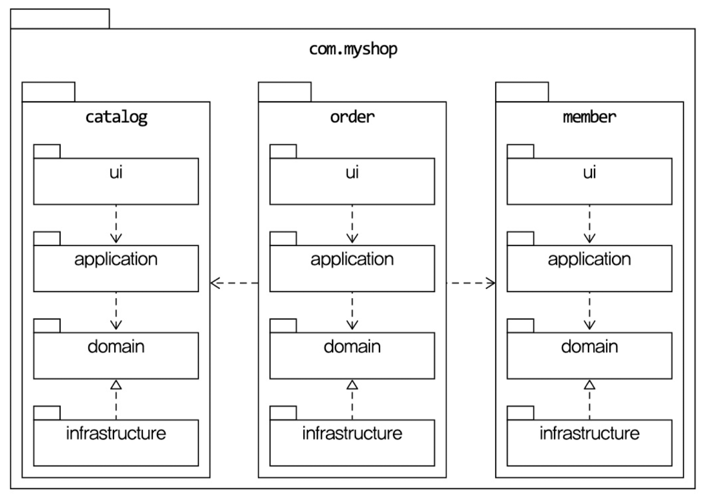
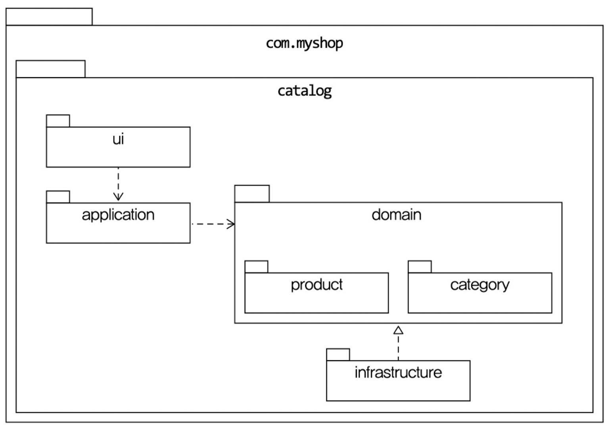

## 네 개의 영역

`표현` - `응용` - `도메인` - `인프라스트럭처` 는 아키텍처를 설계할 때 함께 등장하는 전형적인 네가지 영역이다.


표현 영역을 통해 사용자의 요청을 전달 받는 응용 영역은 시스템이 사용자에게 제공해야 할 기능을 구현한다. 이때 응용 영역의  "예약" , "예약 취소"와 같은 기능 구현을 구현하기 위해 도메인 영역의 도메인 모델을 사용한다.

```java
public class CancelOrderService {

	@Transactional
	public void cancelOrder(String orderId) {
		Order order = findOrderById(orderId);
		if(order == null) throw new OrderNotFoundException(orderId);
		order.cancel();
	}
}
```

응용 서비스는 로직을 직접 수행하기보다는 도메인 모델에 로직 수행을 위임한다.
(주문 취소 로직을 Order 객체에 취소 처리를 위임하고 있다.)

인프라스트럭처 영역은 나머지 세 영역(표현, 응용, 도메인)을 지원하는 기술적 구현을 담당한다. DB 접근, 메시지 큐 연동, 외부 API 호출 같은 상세 기술 구현이 이 영역에 위치한다.
예를 들어 응용 영역에서 DB에 보관된 데이터가 필요하면 인프라스트럭처 영역의 DB 모듈을 사용하여 데이터를 읽어온다. (기능 구현은 DB 모듈 라이브러리가 구현함)

## 계층 구조 아키텍처
네 영역을 구성할 때 많이 사용하는 아키텍처가 아래와 같은 계층형 아키텍처이다.


계층형 구조의 특징은 상위 계층에서 하위 계층으로의 의존만 존재하고 하위 계층은 상위 계층에 의존하지 않는다.
계층 구조를 엄격하게 적용하면 상위 계층은 바로 아래의 계층에만 의존을 가져야 하지만 구현의 편리함을 위해 유연하게 적용하기도 한다.
- 엄격한 적용: 표현→응용→도메인→인프라 (각 계층은 바로 아래만 의존)
- 유연한 적용: 응용 계층이 도메인을 건너뛰고 인프라를 직접 사용 (예: 응용 서비스에서 Repository를 직접 호출)

이러한 계층 구조는 매우 직관적이고 구조 또한 단순해서 쉽고 빠르게 이해하고 구현할 수 있는 장점이 있다.

하지만 `표현` , `응용`, `도메인` 계층이 상세한 구현 기술을 다루는 인프라스트럭처 계층에 종속된다는 점이다. 즉, 실제 비즈니스 정책은 변경되지 않는데 기술 스택을 변경하는 경우 비즈니스 코드를 수정해야하는 문제가 발생할 수 있다는 것이다.

또한, 응용 영역이 인프라스트럭처 **구현체**에 직접 의존하면 추가적인 문제가 발생할 수 있다.
```java
public class CalculateDiscountService {
    private DroolsRuleEngine ruleEngine; // 인프라 구현체에 직접 의존

    public CalculateDiscountService() {
        ruleEngine = new DroolsRuleEngine(); // 직접 생성까지 함
    }

    public Money calculateDiscount(List<OrderLine> orderLines, String customerId) {
        Customer customer = findCustomer(customerId);

        // Drools에 특화된 코드들이 응용 영역에 침투
        MutableMoney money = new MutableMoney(0);
        List<?> facts = Arrays.asList(customer, money);   // 룰에 필요한 데이터(지식)
        facts.addAll(orderLines);
        ruleEngine.evalute("discountCalculation", facts);  // "discountCalculation" = Drools 세션 이름
        return money.toImmutableMoney();
    }
}
```

얼핏 보면 `CalculateDiscountService`가 Drools의 타입을 직접 import하지 않으니까 의존하지 않는 것처럼 보여. 하지만 실제로는 **간접적으로 완전히 의존**하고 있다.

- 테스트가 어렵다.
	`CalculateDiscountService` 를 테스트하려면 Drools 룰 엔진을 완벽히 작동해야한다.
	이를 위해 Drools와 관련된 설정 파일을 미리 준비해야 함

- 기능 확장(구현 변경)의 어려움
	Drools 세션 이름인 `"discountCalculation"`이 응용 코드에 하드코딩되어 있고, `MutableMoney`는 Drools의 룰 결과를 받기 위해 존재하는 타입이다. 또한 `List<?> facts`에 데이터를 담아서 `evalute()`로 넘기는 패턴 자체가 Drools의 "팩트를 넣고 룰을 실행하는" 방식에 종속되어 있다. 다른 룰 엔진은 이런 패턴을 쓰지 않을 수 있으므로, Drools를 교체하면 응용 서비스 수정 비용이 크게 발생한다.

## DIP

위와 같은 문제를 해결하기 위해 DIP를 적용해보자

**DIP란?**
고수준 모듈이 저수준 모듈에 의존하지 않고, 추상화(인터페이스)에 의존하도록 의존 방향을 역전시키는 원칙이다.

```java
// 고수준 모듈에 위치하는 인터페이스
public interface RuleDiscounter {
	Money applyRules(Customer customer, List<OrderLine> orderLines);
}
```

```java
// 응용 서비스 - 인터페이스에만 의존
public class CalculateDiscountService {
	private RuleDiscounter ruleDiscounter;

	public CalculateDiscountService(RuleDiscounter ruleDiscounter) {
		this.ruleDiscounter = ruleDiscounter; // 생성자 주입
		}

	public Money calculateDiscount(List<OrderLine> orderLines, String customerId) {
	 Customer customer = findCustomer(customerId);
	 return ruleDiscounter.applyRules(customer, orderLines);
	 // Drools 관련 코드가 완전히 사라짐
	 }
 }
```

인터페이스 `ruleDiscounter`를 사용하기 때문에 세부 구현체는 무엇인지 중요하지 않고 세부 구현체가 바뀌더라도 `CalculateDiscountService`를 수정하지 않아도 된다.

덕분에 테스트코드를 작성하더라도 기존에는 `Drools` 와 관련된 설정들이 모두 필요 했지만 `Mock`이나  테스트 더블 객체를 사용해 순수 자바 코드로만으로 빠른 테스트가 가능해졌다.

### DIP 주의사항
DIP를 잘 못 적용하면 단순히 인터페이스와 구현을 분리하는 것으로 끝날 수 있다.
이때 인터페이스와 구현체를 분리하는 것도 중요하지만, **분리 후 인터페이스의 위치**가 중요하다.
- 잘 못 분리한 경우 (interface가 저수준에 위치)
	```mermaid
	classDiagram
    direction TB

    namespace 고수준 {
        class CalculateDiscountService
    }

    namespace 저수준 {
	    class RuleDiscounter {
	            <<interface>>
	        }
        class DroolsRuleDiscounter
    }

    CalculateDiscountService ..> RuleDiscounter
    DroolsRuleDiscounter ..|> RuleDiscounter

	```

- 정상적으로 분리한 경우
	```mermaid
	classDiagram
	    direction TB

	    namespace 고수준 {
	        class CalculateDiscountService
	        class RuleDiscounter {
	            <<interface>>
	        }
	    }

	    namespace 저수준 {
	        class DroolsRuleDiscounter
	    }

	    CalculateDiscountService ..> RuleDiscounter
	    DroolsRuleDiscounter ..|> RuleDiscounter
	```


저수준의 구현체를 인터페이스로 분리하고 이를 고수준 패키지로 올림으로써
고수준(service) -> 저수준(infra) 에서
저수준(infra) <- 고수준(service)  가 되었다.

핵심은 인터페이스의 **위치**다. 인터페이스가 저수준(infra)에 있으면 고수준이 여전히 저수준 **패키지**에 의존한다. 인터페이스를 고수준(도메인)으로 올려야 의존 방향이 진짜로 역전된다.

덕분에 구현체를 의존하면서 발생했던 문제 두가지를 해결할 수 있게 되었다.
- 테스트가 쉬워진다.
- 구현 변경이 쉬워진다.

### DIP와 아키텍처

DIP를 적용하면 인프라스트럭처 영역이 응용/도메인 영역에 의존하게 된다. 이렇게 되면 기존의 `표현→응용→도메인→인프라` 단방향 계층 구조가 깨진다.

대신 도메인이 중심에 있고, 인프라가 도메인을 향해 의존하는 구조가 된다. 이것이 **헥사고날 아키텍처(포트와 어댑터)**의 기본 아이디어와 연결된다.

- **포트(Port)**: 도메인/응용 계층이 정의하는 인터페이스 (예: `RuleDiscounter`, `Repository`)
- **어댑터(Adapter)**: 인프라 계층에서 포트를 구현하는 구체 클래스 (예: `DroolsRuleDiscounter`, `JpaRepository`)

도메인은 포트만 알고, 어떤 어댑터가 연결되는지 모른다. 덕분에 어댑터를 교체해도 도메인 코드는 영향을 받지 않는다.

> 객체지향을 처음 공부하고 DIP 개념을 처음 알 았을 때  자바로 개발할 때 항상 DIP, 의존성 주입 할 수 있는 클래스를 만들고 인터페이스를 강박적으로 분리해야 한다고 생각했다.
>
> 하지만 항상 좋은 코드일까? 어느 부분에선 맞을 수 있지만
> 실제로 프로젝트를 진행하면서 오히려 복잡도가 증가하고 개발속도를 저하시키는 문제가 발생했다.
>
> 그렇다고 DIP의 장점을 잘 살리는 테스트 코드를 작성했던 것도, 구현체가 변경되는 일이 생긴 것도 아니였다.  따라서 상황에 따라서 DIP 를 인지하고 적용하고 바로 추상화 대상이 떠오르지 않는다면 실제 변경이 발생하는 시점에 DIP 적용을 고려한는 것도 좋은 선택지 인 것 같다.
>
> 즉, 항상 DIP를 강제해야 한다. 라는건 조심할 필요가 있는 표현이다.
>
> DDD, 객체지향은 정답 만능 설계가 있을진 모르지만
> 단순히 따라하는게 아니라 직접 필요를 느끼고 이해하는 것이 중요한 것 같다.


### 도메인 영역의 주요 구성요소

- `Entity` : 고유의 식별자를 갖는 객체로 자신의 라이프 사이클을 갖는다.
- `Value`: 고유 식별자를 갖지 않고 주로 개념적으로 하나인 값을 표현할 때 사용한다.
- `Aggregate` : 연관돈 엔티티와 밸류 객첼를 개념적으로 하나로 묶은 것이다.
- `Repository` : 도메인 모델의 영속성을 처리하고 엔티티 객체를 로딩하거나 저장한다.
- `Domain Service` : 특정 엔티티에 속하지 않는 도메인 로직을 제공한다.
	- `할인 금액 계산`의 경우  상품, 쿠폰, 회원 등급 등 다양한 조건을 이용해서 구현하게 되는데 이렇게 도메인 로직이 여러 엔티티와 밸류를 필요로 하면 도메인 서비스에서 로직을 구현

> 아직 명확하게 애그리거트, 도메인 서비스를 구분하는 것이 어렵다.
> 도메인 이해도가 부족해서 그런걸까...

저서분도 초반엔 도메인 모델의 엔티티와 DB 모델의 엔티티를 거의 같은 것으로 생각했다고 한다.
경험이 쌓일수록 도메인 모델에 대한 이해도 높아지면서 구분하는 능력을 키웠다고 한다.

### 가장 큰 차이점?

도메인 모델의 엔티티는 데이터와 함께 도메인 기능을 제공한다는 점이다.

- ❌  데이터만 제공하는 도메인 모델  (Bad)
	```java
	public class Order {
	    private Long id;
	    private OrderStatus status;
	    private ShippingInfo shippingInfo;
	    private List<OrderLine> orderLines;
	    private Money totalAmounts;

	    // getter/setter만 존재
	    public void setStatus(OrderStatus status) { this.status = status; }
	    public void setShippingInfo(ShippingInfo info) { this.shippingInfo = info; }
	    public void setTotalAmounts(Money money) { this.totalAmounts = money; }
	}
	```

위와 같이 get, setter만 제공하는 경우 도메인 객체의 데이터를 변경하고 검증하는 로직이 외부 서비스 레이어에서 처리하게 된다.

이런 경우 해당 도메인의 비즈니스 정책인 배송 전에만 변경 가능이라는 규칙이 존재한다면, 이를 사용하는 서비스 레이어에서 모두 구현해야하고 유지보수가 어렵게 된다.

> 근데 특정 서비스에서는 해당 정책을 무시할 수 있는 신규 기획이 발생한다면? 그런 경우
> 해당 정책 전용 메서드를 도메인에 만들어야 하나? 아니면 그건 다른 도메인인가?
>
>도메인에 새로운 메서드를 만들어서 도메인 기능으로 분리르 생각해 봤었다.
   그러면서 추가 의문은 그렇게 도메인에 너무 많은 메서드가 생기면 그거 또한 관리하기 어려워 지는건 아닐까? 라는 궁금증이 생김 -> 정책을 처리하는 (전략패턴) 클래스를 주입 받아서 동적으로 처리 - 복잡도 증가하기 때문에 트레이드 오프를 고려해야겠다.

해당 질문을 클로드 코드에게 해봤다.

**결론적으로**, 서비스 레이어에서 도메인 규칙을 우회하는 순간 DDD의 의미가 사라져. 새로운 기획이 기존 정책과 다르면, 그건 **새로운 도메인 규칙**이니까 도메인 안에서 표현해야 해. 메서드 분리로 충분한지, 별도 애그리거트가 필요한지는 복잡도에 따라 판단하면 돼.

### Value는 불변으로 사용하는걸 권장한다.

엔티티의 밸류 타입 데이터를 변경할 때는 객체 자제를 완전히 교체하자.

> VO 자체가 비즈니스 정책을 잘 의미하는 하나의 데이터를 의미하는데 특정 필드만 변경하면서
> 오류가 발생할 수 있고 또한 생성자를 통해 만들 때 유효성 검증을 한 곳에서 진행하면서 일관성과 신뢰도를 높여 사이드 이펙트를 차단할 수 있을 것 같다는 생각

### 애그리거트

도메인 모델이 복잡해지면 개발자가 전체 구조가 아닌 한 개 엔티티와 밸류에만 집중하는 상황이 발생한다. 이는 큰 수준에서 모델을 이해하지 못하는 문제를 발생시킨다.

이러한 문제를 방지하고자 도메인 모델에서는 애그리거트를 통해 도움 받을 수 있다.
애그리거트는 관련 객체를 하나로 묶은 군집이다.

> 애그리거트는 어떻게 묶어야 할까...

Claude한테 물어보니 아래와 같은 답변을 받았다.

- 함께 생성되고 함께 삭제되는가?
- 독립적으로 조회 , 저장할 필요가 있는가?
- 하나가 변경될 때 다른 것도 반드시 함께 변경되어야 하는가? (트랜잭션 단위)

	**예시: 게시글(Post)과 조회수(ViewCount)**

	- **게시글 내용(Post Content):** 작성자가 글을 올린 후 수정하는 일은 매우 드뭅니다. (변경 빈도: 낮음)

	- **조회수(ViewCount):** 인기 글의 경우 1초에도 수백 번씩 변경됩니다. (변경 빈도: 매우 높음)


	만약 이 둘을 `Post`라는 하나의 애그리거트로 묶어두면 어떻게 될까요?

	1. 작성자가 오타를 발견해서 게시글 내용을 수정하려고 수정 창을 엽니다. (현재 버전: 1)

	2. 그 사이 수백 명의 유저가 글을 읽으며 조회수가 팍팍 오릅니다. (현재 버전: 150)

	3. 작성자가 오타 수정을 마치고 '저장' 버튼을 누릅니다.

	4. **에러 발생! (OptimisticLockingFailureException):** "당신이 수정하려던 사이 누군가(조회수 증가 로직) 데이터를 변경했습니다."라며 **작성자의 글 수정이 실패(Rollback)**해버립니다.

	 > 잘 이해가 되지 않아서 Gemini에게 위와 같은 예시를 받을 수 있었다.

위 내용은 책 초반 부분에서 언급된 내용과 일치하는 것 같다.

이렇게 애그리거트를 사용하면 개별 객체가 아닌 관련 객체를 묶어서 객체 군집 단위로 모델을 바라볼 수 있게 되기에 개별 객첵 간의 관계가 아닌 애그리거트 간의 관계로 도메인 모델을 이해하고 구현하게 되어, 이를 통해 큰 틀에서 도메인 모델을 관리할 수 있다고 한다.

애그리거트는 군집에 속한 객체를 관리하는 `루트 엔티티`를 갖는다.
`루트 엔티티`는 애그리거트에 속해 있는 엔티티와 밸류 객체를 이용해서 애그리거트가 구현해야 할 기능을 제공한다. 이를 통해서 간접적으로 애그리거트 내의 다른 엔티티나 벨류 객체에 접근한다.

### Repository

애그리거트 단위로 도메인 객체를 저장하고 조회하는 기능을 정의한다.
도메인 모델이 특정 DB 기술(JPA, Mybatis 등)에 의존하지 않도록 막아주는 역할을 한다.

따라서 리포지토리를 사용할 때 `interface`를 활용해서 이전에 설명한 `DIP` 를 따르는 것이 좋은데
Spring Data JPA를 사용하게 되면 해당 기술이 도메인에 침투하게 된다.

해당 부분은 구현 편의성과 트레이드 오프를 고려해야한다.


## 요청 처리 흐름



사용자의 요청은
**Controller(검증/통역)  ->  App Service(트랜잭션/지휘)  ->  Domain(비즈니스 로직)]**
순서로 흐르며, 각 계층은 자신의 역할만 수행해야 시스템이 복잡해져도 유지보수가 무너지지 않는다는 것이 이번 장의 핵심 메시지

## Infrastructure

인프라스트럭처는 표현 영역, 응용 영역, 도메인 영역을 지원한다.
해당 영역은 DIP에서 언급한 것처럼 도메인 영역과 응용 영역에서 인프라스트럭처의 기능을 직접 사용하는 것보다 추상 `interface` 계층을 두 계층에 두고 인프라스트럭처 계층에서는 이를 구현하는 방식으로 활용하는 것이 유연한 환경을 만들어준다.

DIP에서 같은 얘기를 다뤘기 때문에 짧게 넘어간다.

실제로 서비스에서 사용하고 있는 기술이 바뀌는 일은 드물기에 구현체가 변경되는 일은 거의 없다.
언제 발생할 지 모르는 일 때문에 구현 복잡도를 높이는 것이 항상 옳은 것은 아니기에 많은 사람들이 타협을 하고 사용한다.

특히 Spring Data JPA가 큰 예시가 되는 것 같다. (도메인에 `@Entity`사용 등)


## 모듈 구성
패키지 구성 규칙에 정답이 존재하는 것은 아니다.

> 하지만 항상 좋은 구성을 찾기위해 노력하는 것 같다. 실제로 바꾸는건 어렵지만

책에서는 아래와 같은 구조를 가지고 있다.


도메인이 크면 하위 도메인으로 나누고 각 하위 도메인 마다 별도 패키지를 구성한다.

도메인 모듈은 도메인에 속한 애그리거트를 기준으로 다시 패키지를 구성한다.



모듈 구조를 얼마나 세분화해야 하는지 정해진 규칙은 없다고 한다.
한 패키지에 너무 많은 타입이 몰려서 코드를 찾을 때 불편한 정도만 아니면 된다고 하니 이건 사용하는 사람마다 기준이 다를 것 같다.

> 실제로 개발하면서 모듈 분리를 설계하고 직접 실행할 수 있는 설계력을 키워보자
