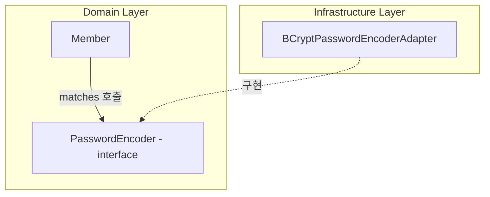
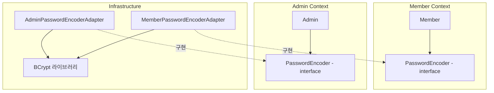

# 응용 서비스와 표현 영역
응용 서비스의 메서드가 요구하는 파라미터와 표현 영역이 사용자로부터 전달받은 데이터는
형식이 일치하지 않기 때문에 표현 영역은 응용 서비스가 요구하는 형식으로 사용자 요청을 변
환한다.

응용 서비스 레이어를 실행 하기전 응용 서비스에서 요구하는 타입에 맞게 변환 후 호출한다.
또한 호출 후 제공 받은 응답을 클라이언트가 원하는 HTML, JSON 등으로 수정해서 반환한다.

반대로 응용 계층은 표현 영역이 REST API를 호출하는지, TCP 소켓을 사용하는지 알 필요가 없다.

> 각 레이어에 맞는 책임을 수행하는 것이 중요하다.
> 다른 것은 관심 없다.

### 6.2 응용 서비스의 역할
1. 응용 서비스의 주요 역할은 도메인 객체를 사용해서 사용자의 요청을 처리하는 것이다.

    응용 서비스에서으 주요 플로우

   1. 리퍼지토리에서 애그리거트를 구한다.
   2. 애그리거트의 도메인 기능을 실행한다
   3. 결과를 리턴한다.

    > 여기서 2번 애그리거트 자체를 @Entity로 관리할 수 있겠지만 
    > 아닌 경우엔 Mapping하는 매퍼도 필요할 듯

    **이러한 응용 서비스가 복잡하다면 응용 서비스에서 도메인 로직의 일부를 구현하고 있을 가능성이 높다.**

   - 코드 중복
   - 로직 분산
   과 같은 코드 품질과 유지보수에 안좋은 영향을 준다.

2. 응용 서비스는 트랜잭션 처리도 담당한다.

   응용 서비스는 도메인의 상태 변경을 트랜잭션으로 처리해야 한다.
   트랜 잭션을 잘 관리하지 않는 경우 일부 상태만 변경되어 일관성이 꺠지는 현상이 발생할 수 있다.

3. 도메인 로직 넣지 않기
   해당 규칙은 앞 장들에도 많이 나온 내용이고 해당 도메인 책임을 응용 레이어로 나오게 한다면 
   중복된 코드를 유발하고 응집도가 떨어진다.

### 도메인 로직 넣지 말기 예시 코드에서 PasswordEncoder를 사용하는 것을 보고 정리

먼저 책 예시로 아래와 같은 코드를 봤다.

```java
// 응용 서비스 — 흐름만 제어
public class ChangePasswordService {
    public void changePassword(String memberId, String oldPw, String newPw) {
        Member member = memberRepository.findById(memberId);
        checkMemberExists(member);
        member.changePassword(oldPw, newPw);   // 도메인 로직 호출
    }
}

// 도메인 — 규칙은 여기에
public class Member {
    public void changePassword(String oldPw, String newPw) {
        if (!matchPassword(oldPw)) throw new BadPasswordException();
        setPassword(newPw);
    }

    public boolean matchPassword(String pwd) {
        return passwordEncoder.matches(pwd);   // ← 여기가 의문 지점
    }
}
```
### 2. 내가 가진 의문
> "도메인 계층은 다른 계층을 의존하지 말라"고 했는데, `Member`가 `passwordEncoder.matches()`를 호출하는 건 모순 아닌가?

클로드 코드와 함께 대화하면서 핵심 원칙을 다시 정리할 수 있었다.

규칙의 정확한 표현은 **"의존하지 말라"가 아니라 "의존성 방향이 도메인을 향하라"**

|화살표 방향|가능 여부|
|---|---|
|도메인 → 인프라 (구체 기술)|❌|
|인프라 → 도메인 (추상)|✅|

핵심은 **`PasswordEncoder`가 어디에 정의되어 있느냐** — 인터페이스가 도메인 패키지에 있다면 도메인 내부 협력일 뿐이다.

### 의존 관계 시각화



화살표를 보면:

- `Member` → `PasswordEncoder`: 같은 도메인 안에서의 협력 (방향 OK)
- `BCryptPasswordEncoderAdapter` → `PasswordEncoder`: 인프라가 도메인을 향함 (방향 OK)

도메인은 자기가 정의한 추상에만 의존하고, 어떤 구체 기술도 모른다. → **의존성 역전 원칙(DIP)**, **헥사고날 아키텍처의 포트와 어댑터** 그 자체.

---

### 더 나아가 다른 도메인에서도 PasswordEncoder가 필요한 경우엔 어떡하지?

> 위 질문에 나는 다른 도메인에서도 PasswordEncoder가 필요하면, 그 도메인 안에도 동일한 
> 인터페이스를 만들고 구현체를 주입해서 사용하면 된다고 생각한다.

라고 나의 의견을 클로드에게 물어봤고 아래와 같이 피드백을 받을 수 있었다.

클로드 : 동일한 인터페이스를 만든다"보다는 "각 바운디드 컨텍스트가 자기에게 필요한 포트를 스스로 정의한다" 가 정확한 표현이다.

|구분|설명|
|---|---|
|같은 바운디드 컨텍스트|인터페이스 1개. 그 안의 여러 엔티티가 공유.|
|다른 바운디드 컨텍스트|컨텍스트마다 자체 포트 정의. 시그니처가 같아 보여도 **개념적으로 다른 것**.|
|공통 모듈에 두기|컨텍스트 간 결합이 생김. 일반적으로 지양.|

> 그렇다면 언제 공통 모듈로 올리는 것이 좋을까?
> 공통 모듈을 지양하는 것에 동의한다. (짬통이 될 수 있고 레거시 모놀리식 구조가 되어버린다.)

다이러그램으로 정리해 두자



단순히 DDD 공부하니까 거기서 클린 아키텍처는 이런 구조라고 하던데?
하고 분리하는게 끝이 아니라 왜 이렇게 분리해야 하는지 정리해보자

- Member 도메인이 나중에 "비밀번호 정책 강화"로 매칭 규칙이 달라져도 Admin과 독립적으로 진화 가능.
- 두 컨텍스트가 같은 인터페이스를 공유하면 변경이 양쪽에 전파되어 결합도가 올라감.

>  레거시를 마이그레이션 해서 무조건 다른 곳에서 사용되는 것이 확정된 것이 아니라면 
>  나는 처음부터 인터페이스를 분리하는 설계는 과한거라고 생각한다.
>  필요할 때 추상화를 고려하고 분리하는 것을 선호한다.

### 실무에서는 Spring Security를 많이 사용하는데?
라는 의문을 가지게 되었고 이는 어떻게 분리하면 좋을지 클로드에게 예시 코드를 작성해달라고 했다.
내용이 길어서 링크를 걸어두겠다.
[https://github.com/subsub97/ddd-study/blob/main/Spring%20Security%EC%99%80%20%ED%95%A8%EA%BB%98%20%EC%82%AC%EC%9A%A9%ED%95%98%EA%B8%B0.md](https://github.com/subsub97/ddd-study/blob/main/Spring%20Security%EC%99%80%20%ED%95%A8%EA%BB%98%20%EC%82%AC%EC%9A%A9%ED%95%98%EA%B8%B0.md)


**다시 생각해보면 좋을 체크리스트**

1. **방향이 어디로 향하는가?** — 의존이 있냐 없냐가 아니라, 화살표가 도메인을 _향하는지_ _벗어나는지_ 본다.
2. **타입이 인터페이스인가 구현체인가?** — 인터페이스 의존은 계약 의존(OK), 구현체 의존은 기술 결박(의심).
3. **import 문에 뭐가 보이는가?** — `org.springframework.*`, `javax.persistence.*`, `infrastructure.*`가 도메인 코드에 보이면 빨간불.
4. **이게 도메인 책임인가, 인프라 디테일인가?** — "비밀번호 일치 여부"는 도메인. "BCrypt 알고리즘 라운드 수"는 인프라.
5. **다른 컨텍스트와 인터페이스를 공유하고 있나?** — 그렇다면 그 결합이 정말 의도한 것인지 점검.

> 도메인은 자기가 정의한 추상에만 의존한다. 구체 기술은 인프라가 어댑터로 깜싸 도메인이 정의한 인터페이스에 끼워넣는다.

### 응용 서비스의 구현

응용 서비스는 표현 영역과 도메인 영역을 연결하는 맥개체 역할을 하는데 이는 디자인 패턴에서 파사드와 같은 역할을 한다.
따라서 응용 서비스 자체는 복잡한 로직을 수행하지 않아야 하는데, 난 항상 응용 서비스가 복잡해 보이고 읽기 싫은 코드로 만든 것 같다.

1. 응용 서비스의 크기
   - 한 응용 서비스에 회원 도메인의 모든 기능 구현하기
   - 구분되는 기능별로 응용 서비스 클래스를 따로 구현하기
   위 두가지는 보통 응용 서비스 레이러를 구현하다보면 자주 고민하게 되는 두가지로 책에서 말하고 있다.
   
   > 이 책을 보기전까지 나 또한 정말 많이 고민했던 부분인 것 같고 아직까지 정확한 정답을 내리지 못했다.
   > 하지만 조금은 나만의 결정을 할 수 있을 것 같다. 해당 절의 마지막에서 정리해보자.
   
   1. 한 응용 서비스에 회원 도메인의 모든 기능 구현하기  
   - 장점
     - 한 도메인과 관련된 기능을 구현한 코드가 한 클래스에 위치하여 각 기능에서 동일한 로직에 대한 코드 중복 제거 가능
   - 단점
     - 코드 크기가 커지면서 연관성이 적은 코드가 한 클래스에 있기에, 관련 없는 코드가 섞인다.
     - 유지보수성이 떨어진다.
     
   2. 구분되는 기능별로 응용 서비스 클래스를 따로 구현하기
      - 장점
        - 코드 품질을 일정 수준으로 유지하는데 도움 된다.
        - 각 클래스별로 필요한 의존 객체만 포함하여 다른 기능을 구현 코드에 영향 받지 않는다.
      - 단점
        - 클래스 수가 많아진다.
        - 여러 코드에 중복된 코드를 구현할 가능성이 높아진다. (동일 클래스인 경우 private method 로 분리 가능)
        
   > 실무 에시로 든다면, 현재 회사에서는 이벤트 성으로 자주 만들어지고 한달이내로 끝나는 단발성 기능 개발이 많다.
   > 이런 경우 하나의 서비스에 응집해서 만들고 오히려 응집도를 높여서 다른 사람들이 이벤트를 파악할 때 쉽게 할 수 있을 것 같다.
   > 다만, 다음 이벤트에서도 동일한 로직이 생긴다면 그 때는 클래스 분리를 고민해볼 것 같다.

2. 응용 서비스와 인터페이스
   응용 서비스를 구현할 때 "인터페이스가 꼭 필요할까?" 많은 개발자들이 고민하는 영영이다.

    1. 구현 클래스가 여러개 인가?
    2. 런타임에 구현 객체를 교체해야 하는가?
   2변의 경우 디자인 패턴 중 전략패턴을 가능하게 하는 아주 좋은 다형성을 사용하는 사례라고 생각한다.
   한 때 해당 방식이 무조건 정답이라고 생각했고 무지성으로 분리해서 구현하려고 했던것 같다.
   하지만, 실제로 구현 클래스가 여러개이고 런타임에 변경되는 경우는 드물다. 
   또한 그렇다고 하더라도 해당 방식은 디버깅을 어렵게 하는게 단점이라는 걸 느꼈던 적이 있다.
   정말 필요한 경우인지 생각하고 판단하는 것이 좋을 것 같다.
    
   반대로 장점으로는 테스트를 작성하는데 편리함을 준다. 특히 나는 고전파 스타일을 선호하는데 
   Fake 객체를 만들어 주입해서 사용하는 방식으 좋았다.

3. 메서드 파라미터와 값 리턴
   - 응용 서비스에서 애그리거트 자체를 리턴
   - 응용 서비스는 표현 영역에서 필요한 데이터만 리턴
   
   크게 위 두가지 방식으로 표현 레이어로 응답을 제공할 수 있다.
   만약 애그리거트 자체를 리턴한다면 표현 계층에서는 이를 다시 처리하는 과정을 거쳐야 할 수 있다. (필요한 정보만 추출 등..)
   코딩 자체는 편하지만 `표현`, `응용` 두 곳에서 도메인 로직 실행을 할 수 있게되고 응집도를 낮추는 원인이 된다.
   
   특별한 이유가 없는 경우라면 표현 영역에서 필요한 데이터만 리턴하는 것이 기능 실행 로직의 응집도를 높인다는 관점에서 좋은 방법이다.

4. 표현 영역에 의존하지 않기
   - `HttpServletRequest`나 `HttpSession`을 응용 서비스에 파라미터로 전달하지 말자.
   DDD의 주요 철학인 의존성을 도메인 방향으로 흐르게 해야하는데 응용 레이어에서 표현 레이어 방향으로 의존성이 바뀌는 문제가 발생한다.
   이런 문제가 생기면 응용 서비스만 단독으로 테스트하기 어렵다.
   
   또한, 표현 레이어와 강하게 결합되어 표현 레이어의 변경이 응용 레이어에 영향을 준다. 
   가장 심각한 문제는 응용 서비스가 표현 레이어의 역할까지 대신하는 상황이 발생할 수 있다.

   예를 들어 `HttpSession`을 전달받아 세션 내부 내용을 확인하고 이후 비즈니스 로직을 처리하는 경우가 발생할 수 있다.


## 값 검증
값 검증은 표현 영역과 응용 서비스 두 곳에서 모두 수행할 수 있다.
원직적으로 모든 값에 대한 검증은 응용 서비스에서 처리한다.

하지만 응용 서비스에서 각 값이 유효한지 확인할 목적으로 익셉션을 사용할 때의 문제점은 사용자에게 좋지 않은 경험을 제공한다는 것이다.
사용자는 폼에 값을 입력하고 전송했는데 입력한 값이 잘못되어 다시 폼에 입력해야 할 때 한개 항목이 아닌 입력한 모든 항목에 대해 한번에 알고 싶다.
하지만 응용 계층에서 하면 검증 실패가 발생하면 익셉션이 발동해 이후 검증 로직은 실행되지 않는다.

> 이러한 문제를 방지하기 위해 `error` 목록을 모아서 한번에 반환할 수 있지만 좋아보이지 않고 예전방식 같다.
> 어떻게 하는게 좋을까?? 흠...

해당 책에서 작가는 표현 영역과 응용 서비스 영역에서 검증 로직을 분리하는 방법보다
가능하면 응용 서비스에서 모든 검증 책임을 하는 것을 선호한다고 한다. 응용 서비스의 완성도 높아지는 것이 이유라고 함 

## 권한 검사
스프링 시큐리티와 같은 보안 프레임워크를 많이 사용하지만 
이를 더난 보통 다음 세 곳에서 권한 검사를 수행할 수 있다.

- 표현 영역
- 응용 서비스
- 도메인

표현 영역에서 하는 기본적인 검사
- 인증된 사용자인지 체크

URL 만으로 접근 제어를 할 수 없는 경우 응용 서비스의 메서드 단위로 권한 검사를 수행해야 한다.

본인이 작성한 글만 삭제할 수 있는 규칙이 존재하는 경우
게시글 애그리거트를 먼저 로딩하고 으용 서비스의 메서드 수준에서 권한 검사를 할 수 없기 때문에 아래와 같은 로직이 필요하다.

```java
public class DeleteArticleService {
   public void delete(String userId, Long articleId) {
       Article article = articleRepository.findById(articleId);
       permissionService.checkDeletePermission(userId, article); // 일치 여부 판단 필요
      article.markDeleted();
   }
}
```

`permissionService` 를 사용해서 삭제 권한이 있는지 확인하는 로직이 필요하다.

> 근데 여기서 궁금한 점이 생겼다. 책에서는  DeleteArticleService에서 delete 메서드를 구현했는데
> 어느 경우 Article 도메인 내부로 delete() 메서드를 구현하고 어느 경우 위와 같이 응용 서비스로 분리해야 할까?

클로드에게 물어봤다.

# 도메인 내부 vs 응용 서비스 — 권한 검사는 어디서 해야 할까?

## 케이스 1 — 도메인 내부에서 처리하는 게 맞는 경우

권한 규칙이 **Article 자신의 상태만으로 결정**될 때.

```java
public class Article {
    private MemberId authorId;

    public void delete(MemberId requesterId) {
        if (!this.authorId.equals(requesterId)) {
            throw new NoPermissionException("삭제 권한이 없습니다.");
        }
        this.deleted = true;
    }
}
```

```java
// 응용 서비스는 단순하게
public class DeleteArticleService {
    public void delete(MemberId requesterId, Long articleId) {
        Article article = articleRepository.findById(articleId);
        article.delete(requesterId); // 도메인이 스스로 검사
    }
}
```

### 이 방식이 적합한 조건

- "작성자만 삭제 가능"처럼 Article이 이미 알고 있는 정보로만 판단 가능
- 권한 규칙이 **Article의 불변식(invariant)** 으로 볼 수 있을 때
- 외부 서비스나 다른 Aggregate 조회 없이 결정 가능

---

## 케이스 2 — 응용 서비스에서 분리해야 하는 경우

권한 판단에 **외부 의존성**이 필요할 때.

```java
public class DeleteArticleService {
    public void delete(String userId, Long articleId) {
        Article article = articleRepository.findById(articleId);
        permissionService.checkDeletePermission(userId, article); // 외부 판단
        article.markDeleted(); // 도메인은 순수하게
    }
}
```

`permissionService` 내부가 이런 식이라면 Article이 직접 알 수 없다.

```java
public class PermissionService {
    public void checkDeletePermission(String userId, Article article) {
        User user = userRepository.findById(userId); // 다른 Aggregate 조회
        if (user.isAdmin()) return;                  // 관리자 예외 처리
        if (!article.isAuthor(userId))               // 작성자 여부
            throw new NoPermissionException();
        // 작성 후 N일 이내만 삭제 가능 같은 정책...
    }
}
```

### 이 방식이 필요한 조건

- 권한 판단에 **다른 Aggregate(User 등) 조회**가 필요
- 관리자, 구독 등급, 기간 제한 같은 **외부 정책이 섞여 있음**
- 권한 규칙이 자주 바뀌거나 여러 도메인에 걸쳐 있음

### 왜 이걸 Article 내부에 넣으면 안 될까?

```java
// ❌ 이렇게 하면 도메인이 오염된다
public class Article {
    public void delete(String userId, UserRepository userRepository) { // 인프라 의존!
        User user = userRepository.findById(userId);
        // ...
    }
}
```

도메인 객체가 Repository나 외부 서비스를 직접 참조하면 **도메인이 인프라에 오염**된다.  
테스트도 어려워지고, 도메인 모델의 순수성이 깨진다.

---

## `markDeleted()` vs `delete(userId)` — 네이밍도 의도가 있다

책에서 `article.markDeleted()`로 분리한 건 의도적이다.

| 메서드 | 의미 | 재사용성 |
|---|---|---|
| `article.markDeleted()` | "삭제 상태로 표시하라" — 순수한 상태 변경 | 어떤 유스케이스에서도 재사용 가능 |
| `article.delete(userId)` | "이 사용자가 삭제한다" — 유스케이스 맥락 포함 | 해당 유스케이스에 종속됨 |

도메인 메서드가 **유스케이스를 모르게** 설계하는 것이 DDD의 지향점이다.  
`markDeleted()`는 관리자 강제 삭제, 배치 삭제, 사용자 직접 삭제 등 어디서든 쓸 수 있지만  
`delete(userId)`는 "사용자가 삭제하는" 맥락에 묶여버린다.

---

## 판단 기준 정리

```
권한 규칙이 해당 Aggregate의 상태만으로 결정되는가?
    │
    ├─ YES → 도메인 내부 메서드에서 처리
    │        article.delete(requesterId)
    │
    └─ NO  → 응용 서비스에서 처리 후 순수 상태 변경만 도메인에 위임
             permissionService.checkDeletePermission(userId, article);
             article.markDeleted();
```

---

## 조회 전용 기능과 응용 서비스
응용 서비스를 항상 만들었던 개발자(= 나)는 컨트롤러와 같은 표현 영역에서 응용 서비스 없이 조회 전용
기능에 접근하는 것이 이상하게 느껴질 수 있다
**하지만 응용 서비스가 사용자 요청 기능을 실행하는데 별 다른 기여를 하지 못한다면 굳이 서비스를 만들지 않아도 된다.**
