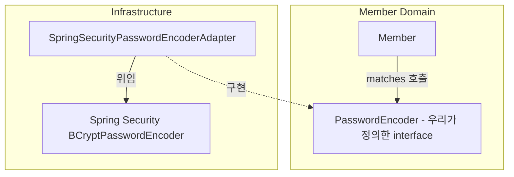

## 5. 실전 — Spring Security와 함께 쓰는 법

현실에선 직접 BCrypt를 만지지 않고 Spring Security가 제공하는 `org.springframework.security.crypto.password.PasswordEncoder`를 쓰는 경우가 대부분. 이때 두 가지 선택지가 있다.

### ❌ 안티패턴: 도메인이 Spring Security 직접 의존

```java
package com.example.member.domain;

import org.springframework.security.crypto.password.PasswordEncoder;  // 🚨

public class Member {
    private final PasswordEncoder passwordEncoder;   // 도메인이 프레임워크에 묶임
    // ...
}
```

문제점:

- 도메인이 Spring Security에 결박됨 → 프레임워크 교체/제거 시 도메인 코드 다 고쳐야 함.
- 도메인 단위 테스트할 때 Spring 컨텍스트가 따라옴.
- "도메인은 비즈니스 규칙만 담는다"는 원칙 위반.

### ✅ 권장 패턴: 어댑터로 감싸기



#### 1) 도메인 — 우리만의 포트 정의

```java
package com.example.member.domain;

// Spring Security를 import하지 않는다
public interface PasswordEncoder {
    String encode(String rawPassword);
    boolean matches(String rawPassword, String encodedPassword);
}
```

#### 2) 도메인 엔티티 — 우리 인터페이스만 사용

```java
package com.example.member.domain;

public class Member {
    private String password;

    public boolean matchPassword(PasswordEncoder encoder, String pwd) {
        return encoder.matches(pwd, this.password);
    }

    public void changePassword(PasswordEncoder encoder, String oldPw, String newPw) {
        if (!matchPassword(encoder, oldPw)) {
            throw new BadPasswordException();
        }
        this.password = encoder.encode(newPw);
    }
}
```

#### 3) 인프라 — Spring Security를 우리 인터페이스로 어댑팅

```java
package com.example.member.infrastructure;

import com.example.member.domain.PasswordEncoder;            // 우리 것
import org.springframework.security.crypto.password.PasswordEncoder
        as SpringPasswordEncoder;                            // Spring 것
import org.springframework.stereotype.Component;

@Component
public class SpringSecurityPasswordEncoderAdapter implements PasswordEncoder {

    private final SpringPasswordEncoder springEncoder;

    public SpringSecurityPasswordEncoderAdapter(SpringPasswordEncoder springEncoder) {
        this.springEncoder = springEncoder;
    }

    @Override
    public String encode(String rawPassword) {
        return springEncoder.encode(rawPassword);
    }

    @Override
    public boolean matches(String rawPassword, String encodedPassword) {
        return springEncoder.matches(rawPassword, encodedPassword);
    }
}
```

#### 4) Spring Security 빈 등록

```java
package com.example.config;

import org.springframework.context.annotation.Bean;
import org.springframework.context.annotation.Configuration;
import org.springframework.security.crypto.bcrypt.BCryptPasswordEncoder;
import org.springframework.security.crypto.password.PasswordEncoder;

@Configuration
public class SecurityConfig {
    @Bean
    public PasswordEncoder passwordEncoder() {
        return new BCryptPasswordEncoder();
    }
}
```

### 이 구조의 이점

|관점|효과|
|---|---|
|**테스트 용이성**|도메인 테스트 시 Spring 컨텍스트 불필요. `PasswordEncoder` Fake 구현으로 충분.|
|**유연성**|BCrypt → Argon2 교체, Spring Security → 다른 라이브러리 교체 모두 어댑터만 수정.|
|**컨텍스트 분리**|Member 도메인 / Admin 도메인이 각자 자기 포트를 갖고 독립적으로 진화.|
|**도메인 순수성**|도메인 코드에 `org.springframework.*` import가 없음.|
